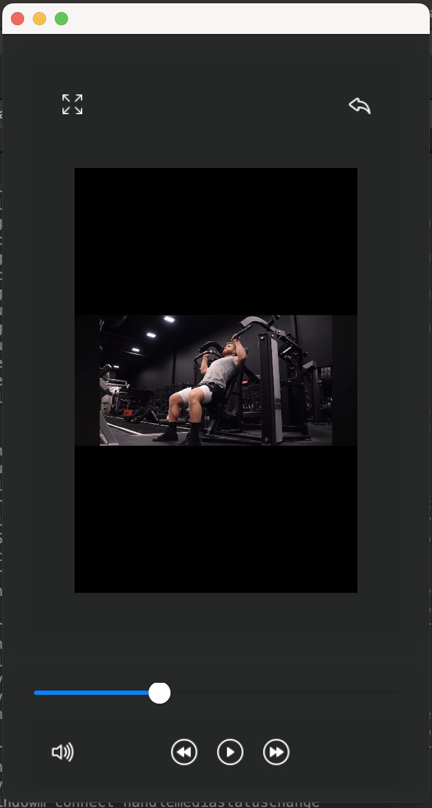
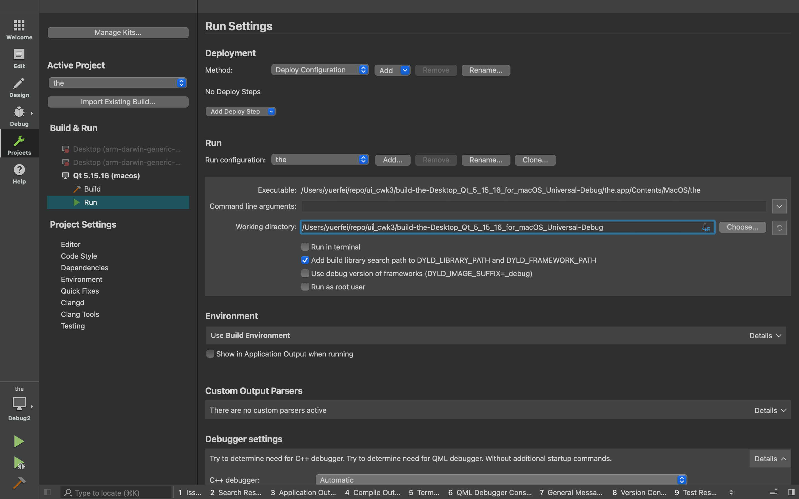

<!-- PROJECT LOGO -->
<br />

<div align="center">
  
  <h3 align="center">SportX</h3>
  <p align="center">
    An awesome outdoor enthusiast' video player app
    <br />
    <a href="https://github.com/454270186/XJCO2811_UserInterface"><strong>Explore the Repo</strong></a>
    <br />
  </p>

</div>


<!-- ABOUT THE PROJECT -->

## About The APP

 


### Built With


<!-- GETTING STARTED -->

## Getting Started

This is an example of how you may give instructions on setting up your project locally.
To get a local copy up and running follow these simple example steps.

### Prerequisites

Ensure that you have install `g++` that supports C++11 and `Qt5.15.2` in your computer


### Installation

#### 1. From GitHub

- Clone the repo

	```
	git clone https://github.com/454270186/XJCO2811_UserInterface.git
	```


#### 2. Download Zip

Download the latest source code and decompress


### How to run

1. Open `*.pro` qmeke config file with `QT Creator`

2. **Set up working directory of Project** ----- **IMPORTANT!!!**

   After opening `QT Creator`, click on the `Projects` button on the right side.

   In **Run Settings**,  set the **Working directory** like this:

   

   

3. Click on the `Run` button in the bottom right corner


<!-- CONTRIBUTING -->

## Contributors

- [Erfei Yu](https://github.com/454270186)
- [Yufei Wang](https://github.com/Deck-Wang416)
- [Zihao You](https://github.com/romanticthemeRT)
- [Biliu Wang](https://github.com/Bi666)
- [Yue Hao](https://github.com/HaoYue201587216)